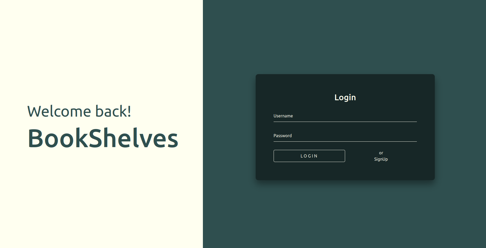
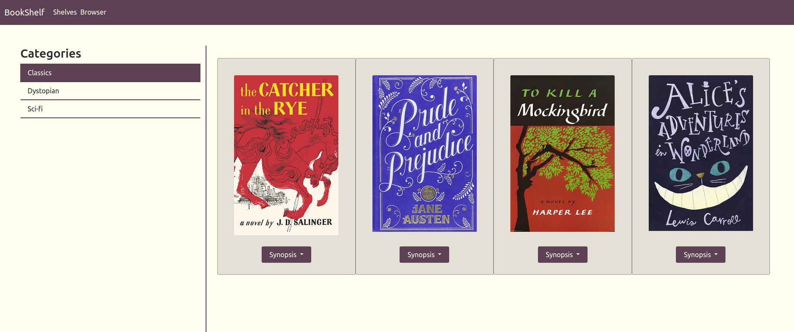
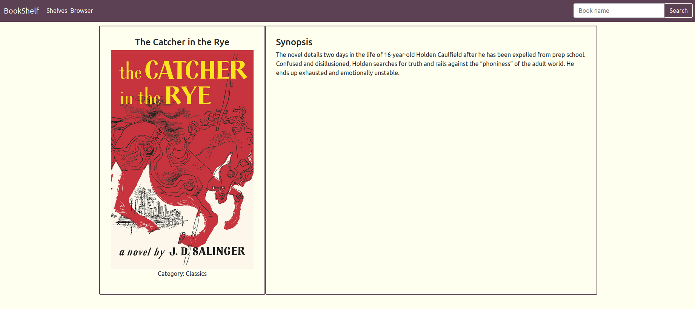

The JEDI Academy at UPC offered a course in HTML, CSS and JavaScript, in which I took part in July 2021 and developed this website as the final project.

Besides the three basic tools for web development, some other ones that I got to learn and use were:

* **Heroku**: A web in which you can store and modify JSON public files in order to make accessible from any computer.
* **Netlify**: A platform that enabled me to deploy the website to the internet.
* **Bootstrap**: A simple framework to get to know how frameworks work.

The aim of the website was to have a log in and sign up page with users and passwords stored in the Heroku platform (a simple way to start to understand how APIs work, but not really suitable for a real project in which passwords must be well secured). And also a bookshelves place in which the user could store the books that they own, which were also stored in the public JSON file.

One thing to note is that Heroku deleted my account due to lack of activity, so the database call does not work, which disables the log in and sign up step and also the book information retrieval.

[Github repo](https://github.com/LauraHPG/web-jedi) | [Website](https://jovial-jepsen-82e02f.netlify.app)
