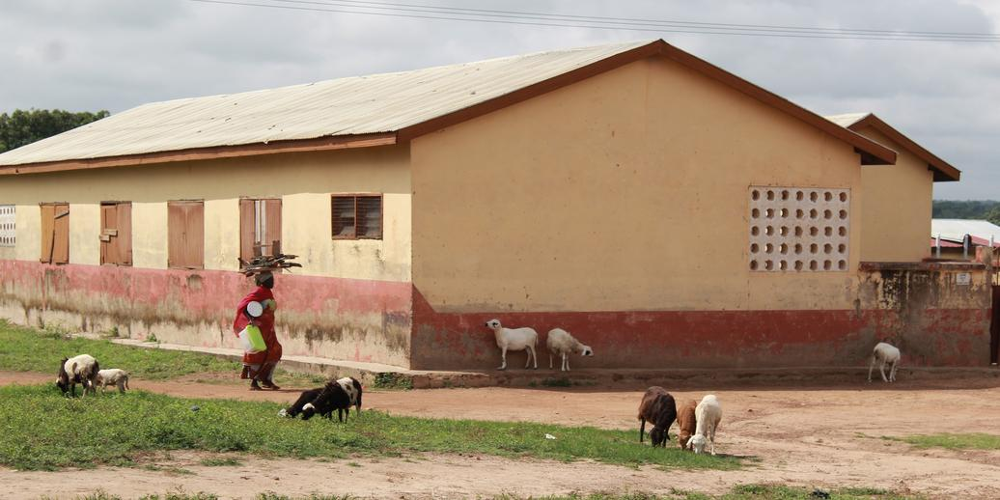
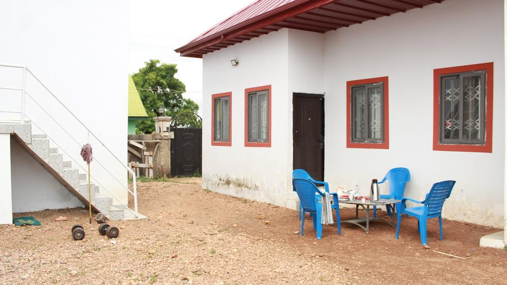
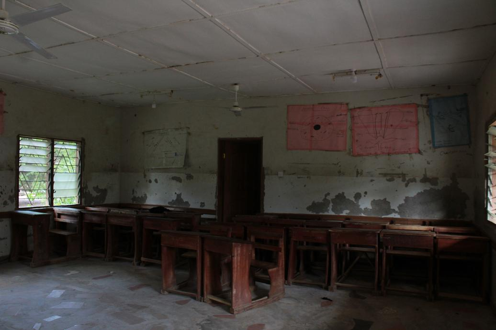
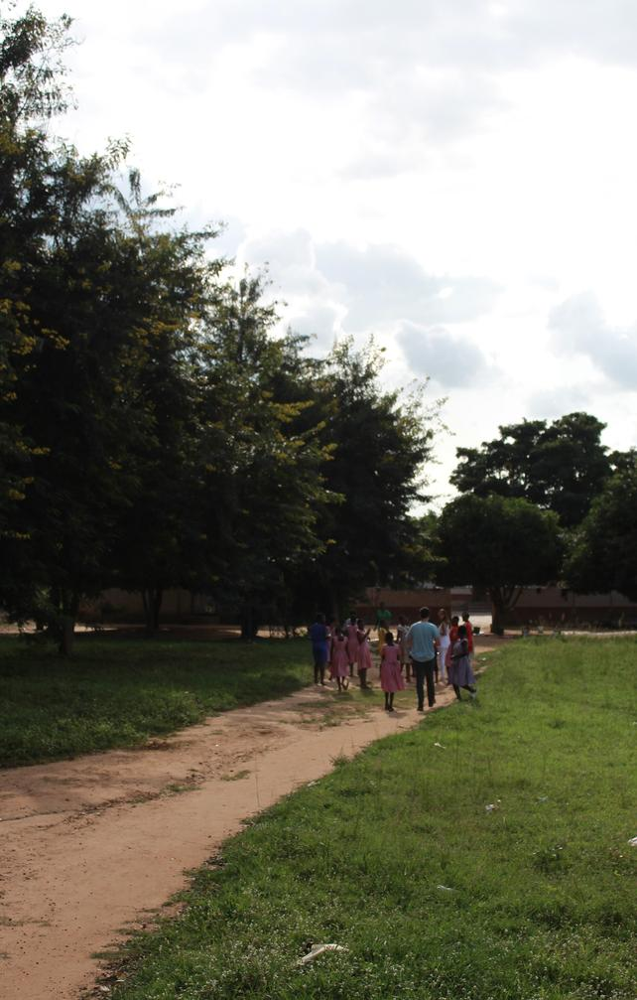

### Enhancing ICT Infrastructure and Training through Volunteer UPC Support for NASCO - Feeding Minds

This past July, [Bea](https://www.linkedin.com/in/beatriz-malpartida-l%C3%B3pez-205283239/), [Guillermo](https://www.linkedin.com/in/guillermo-vidal-sul%C3%A9-821219295/) and I had the opportunity to participate in a volunteer program in Ghana. The initiative was a collaboration between AUCOOP, an association from the Polytechnic University of Catalonia (UPC), and NASCO Feeding Minds, an NGO dedicated to education and ICT development.

### Accomodation and Location

We stayed at the NASCO House in Sawla, located in the Savannah Region, from July 9th to July 28th.

### What did we do?

Our main tasks were as follows:

* **ICT Lab Maintenance:** We visited several towns where NASCO had established ICT labs, diagnosing and resolving issues with the PCs. The schools we visited included St. Cyprians, Sawla D/A, Bole, Kulmasa, and Jintilpe.
* **Teaching at the Code Academy:** The Code Academy aims to equip beneficiaries with skills to meet the demands of the digital industry. Our task was to introduce students to our specialties: telecommunications, hardware, and computer science. We divided the class into three groups based on student interests and taught them about their chosen topic.
* **Teaching Primary School Kids:** We focused on teaching office software using LibreOffice Writer, introducing touch typing, keyboard shortcuts, and basic elements like tables and lists.
* **Teaching Junior High School Students:** Given the students' older age, we taught them Scratch by creating a simple game to demonstrate basic programming concepts such as if statements and loops.

### Pictures

### Assessments

##### Bea

Despite the tough moments, the volunteering experience was immensely rewarding. The kindness and warmth of the people, especially the children, made a lasting impact on me. The challenges I faced only strengthened my resolve and commitment to contributing positively to the community. This experience has been a valuable part of my personal and professional development, and I look forward to more opportunities to volunteer in the future.

##### Laura

Overall, this volunteering experience has been really fulfilling. I've discovered how fun teaching is; got to know the culture and value the openness of the people; and the simplicity and tranquility of the lifestyle has taught me to appreciate the small things in life. I am grateful for the opportunity to contribute to such a dynamic and supportive organization and look forward to future opportunities to collaborate.

##### Guillermo

Volunteering in the ICT lab has been a valuable and rewarding experience. I have gained hands-on technical experience and developed skills that are applicable in real-world scenarios. This experience has not only contributed to my professional growth but has also reinforced my commitment to community service and technology education.
