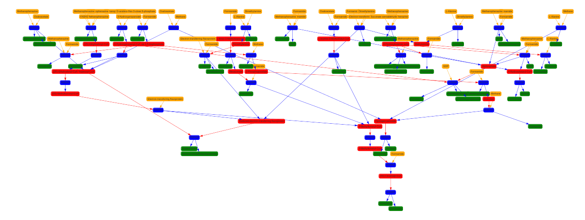
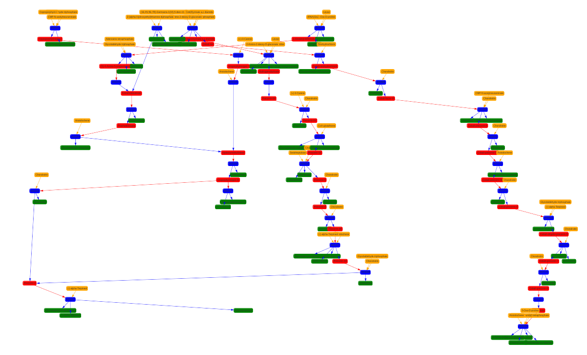
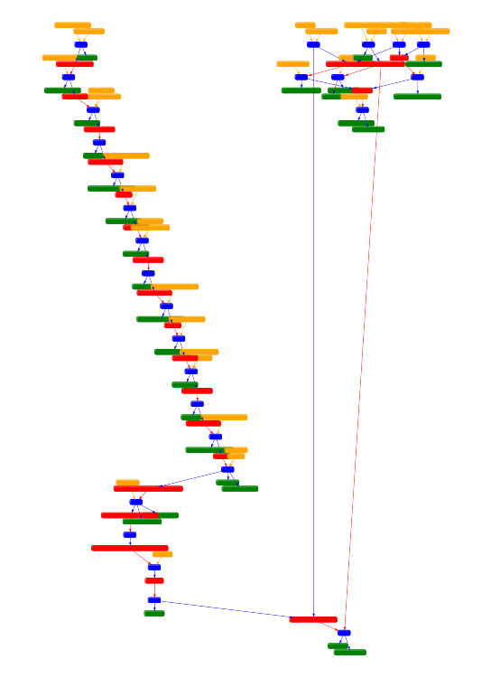

Drawing Metabolic Pathways and Networks in my Bachelor's thesis for the Informatics Engineer degree specialising in Computer Science at Universitat Politècnica de Catalunya.

### Motivation

Traditionally, metabolic pathways have been depicted manually or semiautomatically, a process that is often time-consuming and requires substantial manual adjustments. This thesis presents the development of an automated tool designed
to draw and visualise metabolic pathways and networks, providing researchers with an interactive and efficient means to analyse complex biochemical data.

### Representation of the information

Metabolic pathways can be easily described as hypergraphs. A hypergraph is a generalisation of a graph, in which an edge can join any number of vertices.

However, itn this thesis, we will use an algorithm designed for directed graphs. While our project focuses on exploring hypergraphs, they can be easily transformed and depicted as graphs. As we can see in the following image, i this transformation, hyperedges are represented as nodes, each with their respective incoming and outgoing edges.

### Drawing algorithm

We decided tackle the problem using Sugiyama's algorithm, that places the nodes of a graph into horizontal layers such that the edges, modeling the relationships, point in a uniform direction. There are two main reasons:

* The reasoning behind this decision is that in having the pathway arranged in this fashion, there is a clear flow of the reactions. Metabolic pathways often have a defined directionality, representing the flow of biochemical reactions from substrates to products. A hierarchical layout naturally aligns with this flow, making it easier to follow the sequence of reactions and understand the overall pathway.
* Given the nature of the data, these graphs are always bipartite (compounds are always connected to reactions and never to another component, and similarly with the reactions) the hierarchical structure divides these two types of nodes into compound-layers and reaction-layers, making it easier to distinguish between different types of entities and their roles within the metabolic network.

We used the [grandalf](https://github.com/bdcht/grandalf) package for python to execute the algorithm. However, as we can see in the following example, using simply Sugiyama's algorithm will not lead us to a good representation.

So we needed to process the data, before and after using the algorithm.

### Data processing

Metabolic networks belong to the class of scale-free networks, meaning that small number of compounds are involved in many reactions, whereas the majority of the other compounds are involved in only few reactions.

Taking this information into consideration, the most common strategies have been either duplicating nodes or deleting nodes. Although deletion of nodes is one of the easiest ways to decrease edges, and hence, edge crossings, it is also important to take into account the lost information in the process. Thus, for this thesis, we decided to discard the option of deleting nodes and only duplicating them.

We have taken two types of criteria in order to determine whether a node should be duplicated or not:

* Given a threshold, duplicating all the nodes with degree higher than the specified.
* Presence of a node in cycles. All the elementary circuits are computed, and the node that appears in most circuits is the candidate to be duplicated. As a result, we decrease the number of cycles.

### Graph Fragmentation Index (GFI)

We propose a metric to determine the threshold for each of the pathways, and split the compounds that exceed this threshold.

The duplication operation results in graphs with more nodes while leaving the edges the same way as before, this leads to an increase in connected components. For instance, given a graph G with three nodes A, B, C, and there is an edge from the compound A to the B and another from B to C, when duplicating B, the resulting graph ends up with two connected components.

The Graph Fragmentation Index (GFI) takes this characteristic and computes the limit threshold in which the original graph results in more than one connected component.

With the combination of the GFI and the cycle removal, we are able to preprocess all the graphs depending on their sizes, apply Sugiyama's algorithm and finally some minor tweaks to the output of the grandalf algorithm.

### Results

To visualise the results I also developed a web application using Django. Here are some examples of connected components of different pathways.

### Future research directions

After finishing this thesis, some improvements that could be made are the following:

* Creating a more precise mode to duplicate the compounds, in order to minimise the number of isolated reactions, for instance by having edges with weights depending the contribution on how much information they give about the general graph.
* Visualise the set of metabolic pathways in a more coherent way in relation with reality, such as clustering the pathways that are near each other.
* Getting user feedback in order to improve both the algorithm and the web application, as well as improving the user interface and through his or her experience to enhance usability and accessibility.

Memoir | [Github repo](https://github.com/LauraHPG/TFG-Drawing-oriented-metabolic-pathways-and-networks)
