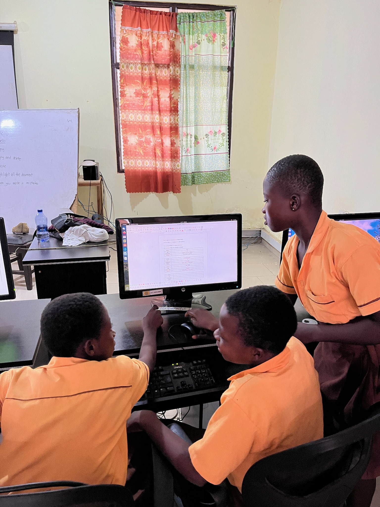

### Enhancing ICT Infrastructure and Training through Volunteer UPC Support for NASCO - Feeding Minds

This past July, Bea, Guillermo and I had the opportunity to participate in a volunteer program in Ghana. The initiative was a collaboration between AUCOOP, an association from the Polytechnic University of Catalonia (UPC), and NASCO Feeding Minds, an NGO dedicated to education and ICT development.

### Accomodation and Location

We stayed at the NASCO House in Sawla, located in the Savannah Region, from July 9th to July 28th. Here is a picture of the place in which we ate our meals and our bedroom.

### What did we do?

Our main tasks were as follows:

##### **ICT Lab Maintenance**

We visited several towns where NASCO had established ICT labs, diagnosing and resolving issues with the PCs. The schools we visited included St. Cyprians, Sawla D/A, Bole, Kulmasa, and Jintilpe (where we took the following picture).

##### **Teaching at the Code Academy**

The Code Academy aims to equip beneficiaries with skills to meet the demands of the digital industry. Our task was to introduce students to our specialties: telecommunications, hardware, and computer science. We divided the class into three groups based on student interests and taught them about their chosen topic. In the picture we can see Majeed, the teacher of the Code Academy.

##### **Teaching Primary School Kids**

We focused on teaching office software using LibreOffice Writer, introducing touch typing, keyboard shortcuts, and basic elements like tables and lists. In the picture there are some kids learning how create and edit tables.

##### **Teaching Junior High School Students**

Given the students' older age, we taught them Scratch by creating a simple game to demonstrate basic programming concepts such as if statements and loops. 

Here is a picture of some girls of a Junior High School the last day.

### Other activities

Aside from the main tasks, we also did some other activities that we really recommend for the future volunteers:

##### Wedding

In Ghana these types of parties are public to everyone, and we had the opportunity to go to a wedding and see some typical dances, music and clothing.

##### **Kulmasa crocodile**

Kulmasa is a town located an hour away from Sawla. We went there to repair the ICT lab, however, there was no electricity. Instead, a teacher offered to take us to see the town's pond, where the revered crocodile lives, an animal they regard as their totem. Locally, they call these crocodiles "nabali," meaning "grandfather."

The name originates from a story passed down through generations. During the colonial era, a man was fleeing from slave merchants when he came across a river. Desperate, he jumped onto what he thought was a floating log, which carried him safely to the other shore. It was only later that he realized the log was actually a crocodile. This crocodile had saved their grandfather, and thus, it became known as "nabali".

When you visit Kulmasa, the locals will call the crocodile by shouting "nabali waana," which means "grandfather, come".

##### Mole Park

We also saw some other animals at the Mole National Park. We did a safari in wich we were able to see some monkeys, elephants and deers. Although it was fun, it started to rain mid way and we ended up soaked up. If you go there, we recommend you to go on other dates.

### Assessments

##### Bea

Despite the tough moments, the volunteering experience was immensely rewarding. The kindness and warmth of the people, especially the children, made a lasting impact on me. The challenges I faced only strengthened my resolve and commitment to contributing positively to the community. This experience has been a valuable part of my personal and professional development, and I look forward to more opportunities to volunteer in the future.

##### Laura

Overall, this volunteering experience has been really fulfilling. I've discovered how fun teaching is; got to know the culture and value the openness of the people; and the simplicity and tranquility of the lifestyle has taught me to appreciate the small things in life. I am grateful for the opportunity to contribute to such a dynamic and supportive organization and look forward to future opportunities to collaborate.

##### Guillermo

Volunteering in Ghana, focusing on ICT center maintenance and teaching, was a deeply rewarding experience. It gave me a firsthand look at the resilience and dedication of the local community. I was inspired by how technology can make a tangible difference in education and was enriched by the connections and insights I gained during my time there.
