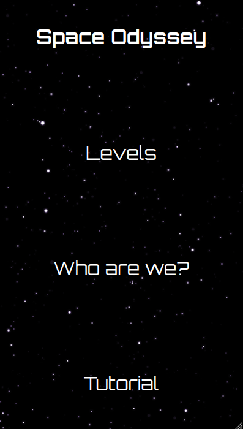
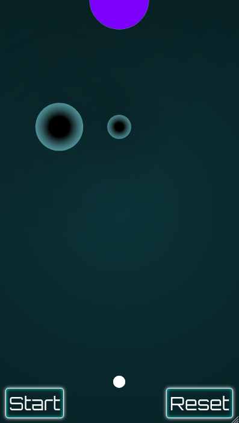
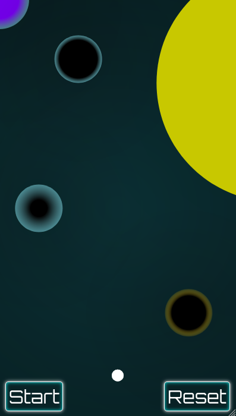

This project was developed at the HackUPC 2022 Hackathon. It was a bigger hackathon than the previous one, with many more competitors, and we felt more pressure. However, we were able to create a project we are really proud of.

It was the time in which wordle was on its peak, so one of the challenges was to create a mobile game.

Space Odissey is a web mobile game in which the main goal is to make the spaceship land on the purple portal. To achieve it, there are certain universal elements with different properties that the user has to move around to attract or repell the spaceship and create a route that makes the spaceship land correctly.

Here you can see the menu page:

And some levels:

[Github repo](https://github.com/perecarrillo/SpaceOdyssey) | [Website](space-odyssey-hackupc.netlify.app)
